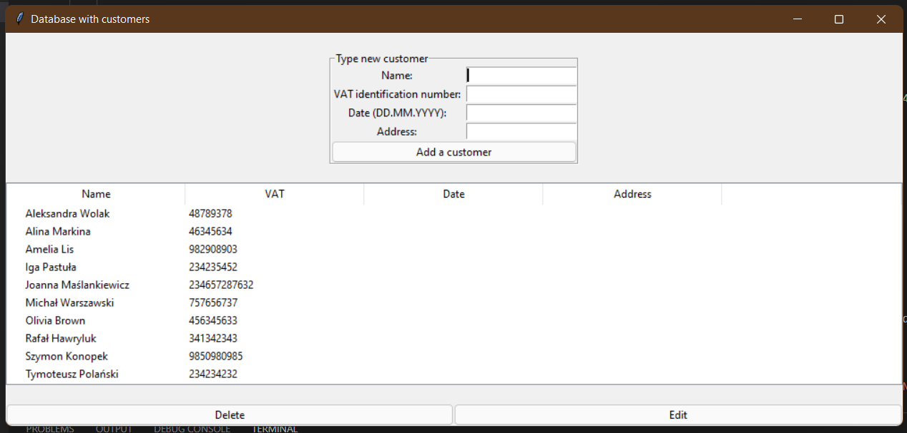
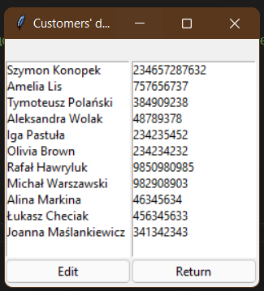

# Application for storing, deleting and editing customer data with Python, Tkinter and SQL
### Project for my future internship

The program consists of 3 independent modules:
- script for creating databases;
- GUI + CRUD for working with SQLite database;
- GUI for a script that displays data about the client.




### Installation and usage

Clone the [repository](https://github.com/urnotrme/Internship-Project.git), and type:

```
python edit_data.py
```
to open main file for editing customer data or...

```
python data_list.py
```
to open a list with customer's data.

to be continued, to be better...
